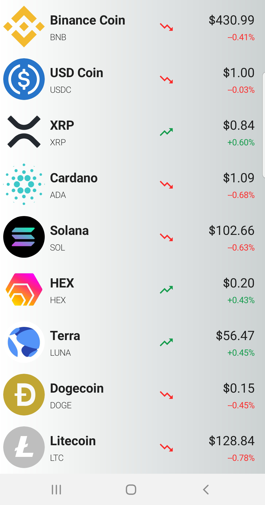

# CryptoApp

This app uses Jetpack Compose UI + Retrofit to fetch the crytocurrency data of the top 50 cryptocurrencies using the Nomics API. The data displays the symbol and currency name plus the current price, trend, and percent price change. This data is automatically refreshed every 30 seconds.

Libraries used include:  
Jetpack Compose  
Compose ViewModel  
Retrofit2  
Moshi  
Hilt  
Coil  

I wrote about building this app in a blog post here:

<https://brianniedzialkoski.blogspot.com/2022/02/a-simple-crypto-app-with-nomics-api.html>

